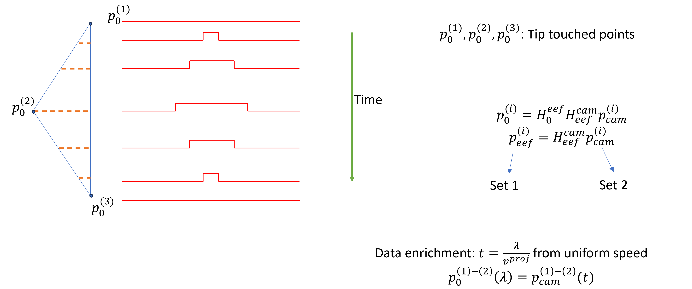
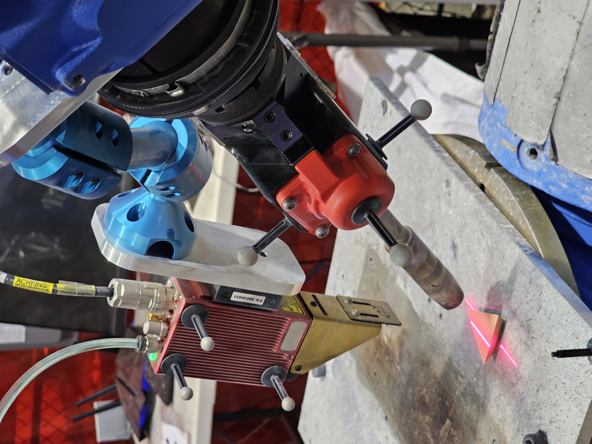
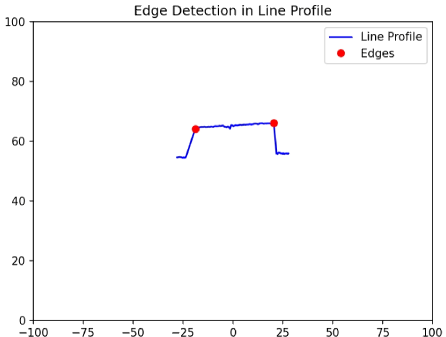

# 2D Laser Camera Handeye Calibration using a Triangle Target.

## Underline Algo

## Procedures

### Points Teaching
Start RR robot driver. Jog to triangle vertices in Teach mode and use `save_q.py` to log the joint angles.

### Scan Motion
`robot_laser_motion_triangle.py` will generate a rough motion to scan over the trangle. Monitor the live scan to make sure the scan covers the entire triangle. Also make move the scan motion up and down.
[View 3D Model](model/triangle.stl)

### Processing
Stack up all frames in time axis. Use `scan_playback.py`, `pc_playback.py` and `edge_detection.py` to check each step's result.
The scripts will identify triangle vertices in time and space, and display as 2D+time 3D pointcloud.

Run `calibration.py` to generate the transformation matrix. 
